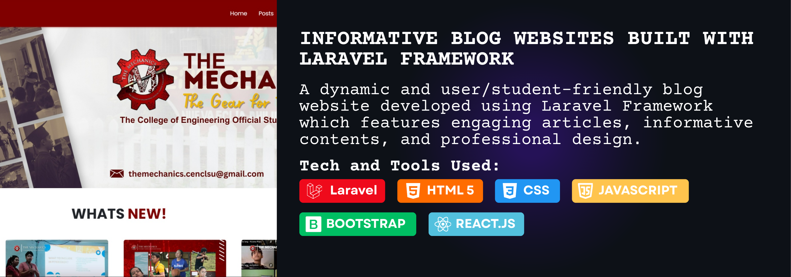
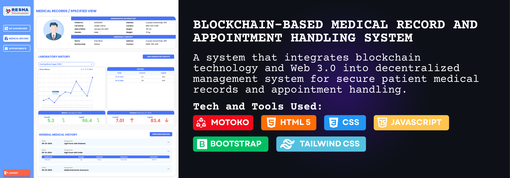
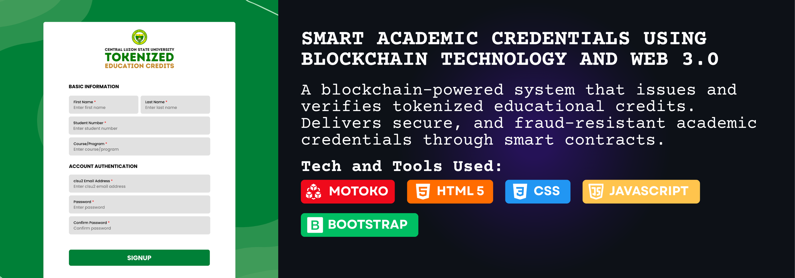
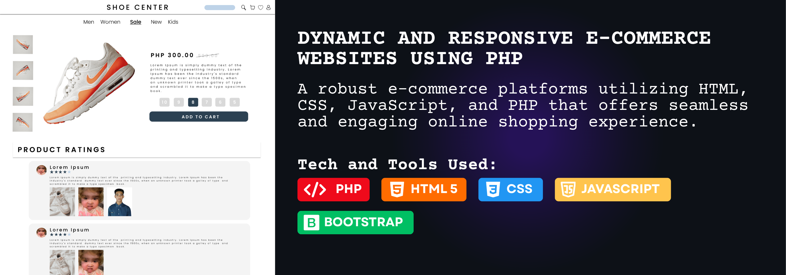
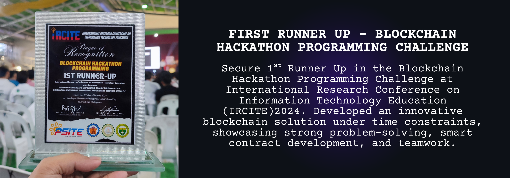
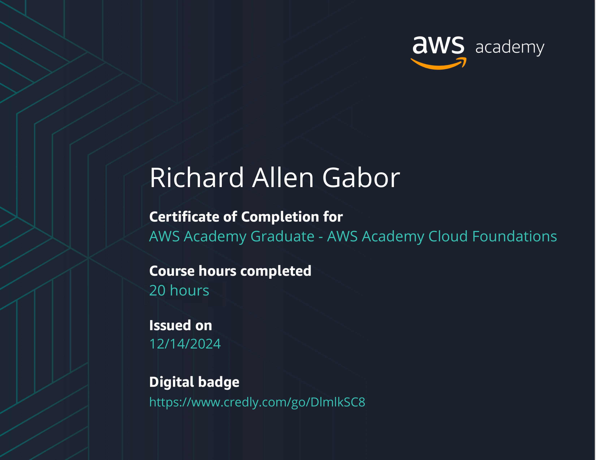

## 🚀 About Me

A motivated fresh graduate from Central Luzon State University (CLSU) with strong foundation in web development. Specialized in building dynamic, responsive and secure web applications using PHP and Laravel Framework. Equipped with hands-on experience from academic projects demonstrating proficiency on both frontend and backend technologies. Passionate about clean code, continuous learning, and delivering user-centered solutions.

## 🛠️ Tech Stack & Tools

## ⚙️ Projects

     
     
     
  

## 📚 Curriculum Vitae

<strong>🔰 CENTRAL LUZON STATE UNIVERSITY</strong>  
<em>Bachelor of Science in Information Technology</em>  
<em>Major in Systems Development</em>  
<em>2021 - 2025</em>  

<strong>🔰 BARTOLOME SANGALANG NATIONAL HIGH SCHOOL</strong>  
<em>Junior and Senior High School</em>  
<em>Science, Technology, Engineering, and Mathematics (STEM)</em>  
<em>2015 - 2021</em>  

<strong>🔰 PASONG INCHIC - SAN RAFAEL ELEMENTARY SCHOOL</strong>  
<em>Elementary Education</em>  
<em>2009 - 2015</em>  

## 🏆 Achievements

## 📜 Certifications

<strong>Amazon Web Services (AWS) Academic Cloud Foundations</strong>  
December 2024

## ⭐ Contacts

<strong>Gmail: </strong> gabor.richardallen@gmail.com
 
<strong>Viber: </strong> 0919-671-8532

